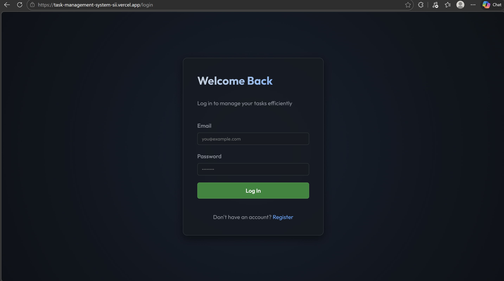
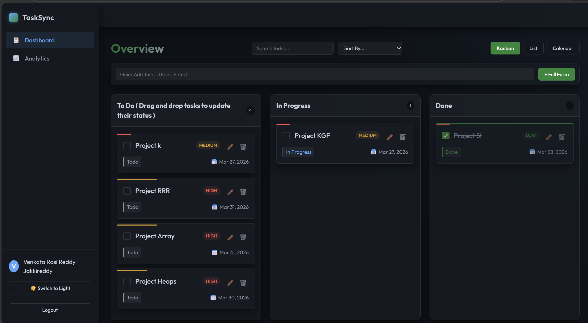
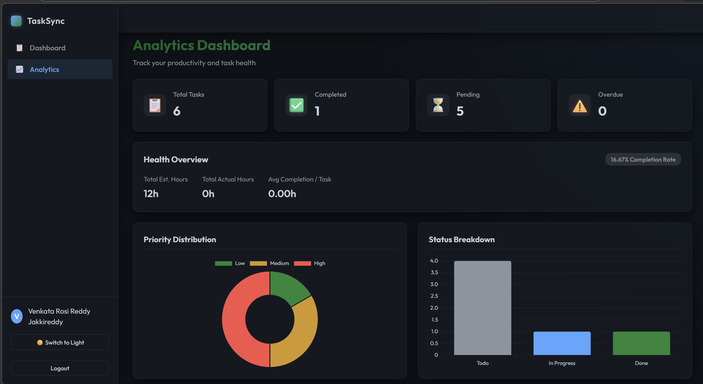
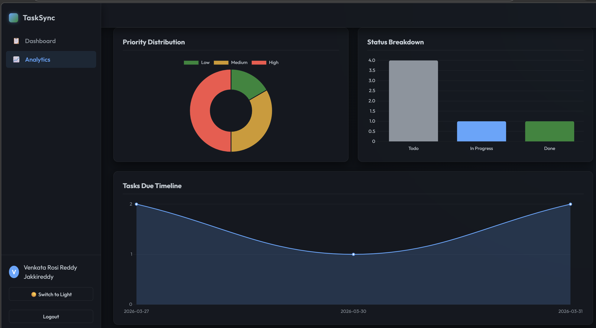

# Task Manager

Full-stack task management application built with **Angular 18** (frontend), **Node.js/Express** (backend), and **MongoDB** (database). Features user authentication, task CRUD operations, and analytics dashboard with charts.

🔗 **Live Demo:** [](https://task-management-system-sii.vercel.app/login)

## Dashboard Preview

<p align="center">
  <br><br>
  <br><br>
  
   
</p>

## Table of Contents
- [Prerequisites](#prerequisites)
- [Backend Setup](#backend-setup)
- [Frontend Setup](#frontend-setup)
- [Running the Application](#running-the-application)
- [API Endpoints](#api-endpoints)
- [Design Decisions](#design-decisions)
- [Troubleshooting](#troubleshooting)
- [Folder Structure](#folder-structure)

## Prerequisites
- Node.js (v18+)
- MongoDB (local or MongoDB Atlas)
- Angular CLI (v18+ for frontend dev)

## Backend Setup
1. Navigate to `server/` directory:
   ```
   cd server
   ```
2. Install dependencies:
   ```
   npm install
   ```
3. Create `.env` file in `server/`:
   ```
   PORT=5000
   MONGO_URI=mongodb://127.0.0.1:27017/task-manager
   JWT_SECRET=your_super_secret_jwt_key_here
   ```
   *(Replace `MONGO_URI` with your MongoDB connection string)*

Backend runs on `http://localhost:5000`.

## Frontend Setup
1. Navigate to `client/` directory:
   ```
   cd client
   ```
2. Install dependencies:
   ```
   npm install
   ```

Frontend runs on `http://localhost:4200` (proxies API to backend).

## Running the Application
1. **Start Backend** (in `server/`):
   ```
   npm install
   npm run build or npm start
   ```
   
   Expected: `Server running on port 5000` & `Connected to MongoDB`

2. **Start Frontend** (in `client/`, new terminal):
   ```
   npm install
   node index.js
   ```

3. Open `http://localhost:4200` in browser.
   - Register/login
   - Create/view/update/delete tasks on Dashboard
   - View analytics

## API Endpoints
All endpoints prefixed with `/api`. Auth required for protected routes (JWT in `Authorization: Bearer <token>`).

| Method | Endpoint              | Description                  | Auth Required | Body Params |
|--------|-----------------------|------------------------------|---------------|-------------|
| POST   | `/auth/register`      | Register new user            | No            | `{email, password, name}` |
| POST   | `/auth/login`         | Login & get JWT              | No            | `{email, password}` |
| GET    | `/auth/me`            | Get current user             | Yes           | - |
| GET    | `/tasks`              | Get user's tasks             | Yes           | - |
| POST   | `/tasks`              | Create task                  | Yes           | `{title, description, priority, dueDate}` |
| PUT    | `/tasks/:id`          | Update task                  | Yes           | `{title, ...}` |
| DELETE | `/tasks/:id`          | Delete task                  | Yes           | - |
| GET    | `/analytics`          | Get task analytics/stats     | Yes           | - |

*CORS enabled for frontend origin.*

## Design Decisions
- **Architecture**: Monorepo (client/server). RESTful API backend with Angular SPA frontend. HTTP-only (JWT in HttpInterceptor).
- **Authentication**: JWT tokens (jsonwebtoken), bcrypt password hashing. Route guards (auth/no-auth) + middleware.
- **Data Layer**: MongoDB + Mongoose ODM (schemas: User, Task). No migrations (Mongo flexibility).
- **Frontend**: Angular 18 standalone components, signals for state, services for API calls, Chart.js for analytics.
- **Security**: Auth middleware on protected routes, input validation, global error handler, CORS.
- **Features**:
  - Task: CRUD with priority/dueDate.
  - Analytics: Stats (completion rates, etc.).
  - UI: Responsive, toast notifications.
- **Dev Tools**: Nodemon (server hot-reload), Angular dev server proxy.

## Troubleshooting
- **MongoDB Connection**: Ensure MongoDB running (`mongod`). Check `MONGO_URI`.
- **CORS/Proxy Issues**: Frontend proxies `/api` to backend (check `angular.json` or `proxy.conf.json`).
- **JWT Errors**: Verify `JWT_SECRET` in `.env`.
- **Port Conflicts**: Change `PORT` env.
- **Build Errors**: `npm ci` for clean install.

## Folder Structure
```
d:/task-manager/
├── client/           # Angular 18 frontend
│   ├── src/app/
│   │   ├── core/     # Services, guards, interceptors
│   │   ├── features/ # Auth, Dashboard, Analytics
│   │   └── shared/   # Reusable components
│   └── package.json
├── server/           # Node/Express/MongoDB backend
│   ├── models/       # Mongoose schemas (User, Task)
│   ├── routes/       # API routes
│   ├── middleware/   # Auth middleware
│   └── index.js
└── README.md
```


---
*Built with ❤️ for task management*
